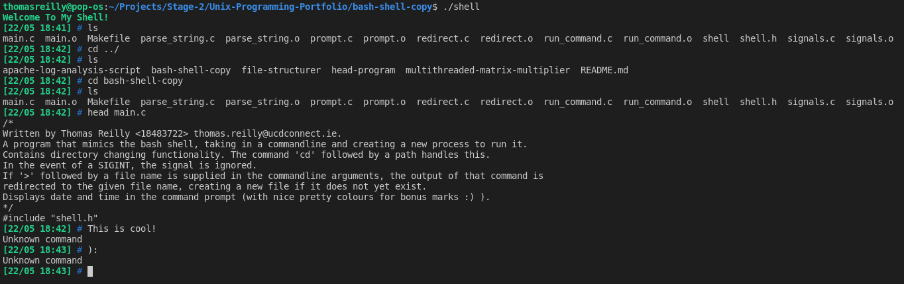

# Unix Programming Portfolio
A collection of C programs, bash and python scripts that I wrote as part of my Unix Programming class in UCD. These projects helped me develop an understanding as to how Unix systems work and how to use them. A vast range of unix features are explored including, 
* Basic use of system calls from the shell and in C 
* Multi-programming and mult-theading in C 
* The C compliation process 
* Bash scripting basics 
* Python scripting basics

A more detailed description of each program can be found below (ordered by last completed).

## Apache Log Search - Python
This Python script takes an apache log file as input and allows us make some interesting analyses on the logs.

The options for the analysis are as follows (you may choose more than one at a time)
* `-l [log file name]` is compulsory
* `-n` gives the number of unique IP addresses in the log
* `-t [n]` gives the top n ip addresses and the number of requests
* `-v [ip address]` gives the number of visits by the given ip address
* `-L [ip address]` gives the requests made by the given ip address
* `-d [date]` where date in the the form DDMMMYYYY Gives the number of requests made by all ips on that date.
    * e.g. `09Feb2013`. 

To run the script you will need a stable version of python

Sample Call
```
python apache_log_search.py -l apache.log -d 09Feb2013
```
This will list the IP's and the number of their logs on the 9th of Febuary 2013 in the apache.log file 

## Directory Copier - Bash
This simple script copies a given directory tree into a new given directory. Any .png files in the original directory are converted to .jpg in the new one.

To run the script be sure to give executable permissons
```
chmod dir_copy.sh +x
```

For example, using the `test_input` directory included.
```
./dir_copy.sh test_input test_output
```
This will create a new directory 'test_output' with the exact directory structure of test_input and any of its .png files in the form of .jpg files. 

## Multi-threaded Matrix Multiplier - C
This is a set of two C programs that make use of POSIX threads and sockets to divide the task of multiplying two matrices among different processes that may or may not exist on seperate machines. The idea behind this is that the task could be performed much quicker in the case of very large input matricies.

2 Programs are included, a `master.c` program and a `worker.c` program

To compile, use the included Makefile
```
make all
```

Start the `master` program giving it the size n of the n*n matrix you would like to test with and the number p of worker processes you would like to divide the task among.
```
./master 10 5
```
Here I create two 10*10 matrices to be multiplied among 5 processes

5 worker instance must now be created to handle the multiplication
```
./worker localhost
```
Here i create a worker searching for a master on my local machine (localhost is not nessesary here as it will default to localhost anyway)

## Bash Shell Copy - C
A C program that makes use of various unix system calls to mimic a bash shell. It can change directories and call all system commands. The prompt displays the current date and time and a # instead of a $.



You can compile and run it yourself (if you have gcc compiler installed) by cloning the repository and navigating to the bash-shell-copy directory. Once there, use the included Makefile to compile.
```
make all
```
Then run the ```shell``` executable file
```
./shell
```

## Head Program - C
Built as an introduction to our Unix programming course. A simple C program that performs just like the head system command in Unix.

The program allows for the following options
* `-n [n]` Prints only the first n lines of the file. Prints just 10 if not specified
* `-o` Prints only the odd lines of the file
* `-e` Prints only the even lines of the file

You can compile and run it yourself (if you have gcc compiler installed) by cloning the repository and navigating to the bash-shell-copy directory and compiling like so.
```
gcc head.c -o head
```
Then to run it,
```
./head text.txt -n 8 -e
```
This will print only the first 8 even lines of text.txt